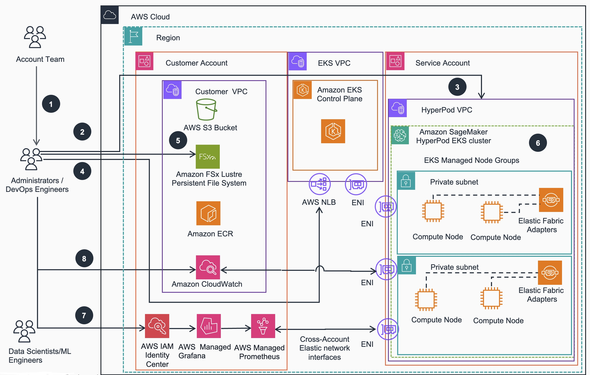

# Guidance for Training Transformer Protein Language Models (ESM-2) with Amazon SageMaker HyperPod on AWS

This guidance aims to instruct users on how to provision SageMaker HyperPod clusters using both [Slurm](https://slurm.schedmd.com/documentation.html) and [Kubernetes](https://kubernetes.io/) based orchestrations. In addition, this guidance provides code examples for pre-training popular computational protein folding models such as [Evolutionary Scale Models (ESM)](https://ramith.fyi/esm-2-evolutionary-scale-prediction-of-atomic-level-protein-structure-with-a-language-model/) 2nd generation using the [DDP and FSDP](https://www.jellyfishtechnologies.com/ddp-vs-fsdp-in-pytorch-unlocking-efficient-multi-gpu-training/) and [NVIDIA BioNemo](https://docs.nvidia.com/bionemo-framework/latest/) frameworks on Amazon [SageMaker Hyperpod](https://aws.amazon.com/sagemaker-ai/hyperpod/) clusters.

## Table of Contents

### Required

1. [Overview](#overview)
    - [Architecture overview](#architecture-overview)
    - [Cost](#cost)
3. [Prerequisites](#prerequisites)
    - [Operating System](#operating-system)
4. [Deployment Steps](#deployment-steps)
5. [Deployment Validation](#deployment-validation)
6. [Running the Guidance](#running-the-guidance)
7. [Next Steps](#next-steps)
8. [Cleanup](#cleanup)
9. [Revisions](#revisions)
10. [Notices](#notices)
11. [Authors](#authors)

## Overview

As generative artificial intelligence (generative AI) continues to transform industries, the life sciences sector is leveraging these advanced technologies to accelerate drug discovery. Generative AI tools powered by deep learning models make it possible to analyze massive datasets, identify patterns, and generate insights to aid the search for new drug compounds. However, running these generative AI workloads requires a full-stack approach that combines robust computing infrastructure with optimized domain-specific software that can accelerate time to solution.

With the recent proliferation of new models and tools in this field, researchers are looking for help to simplify the training, customization, and deployment of these generative AI models. And our high performance computing (HPC) customers are asking for how to easily perform distributed training with these models on AWS. In this guidance, we’ll demonstrate how to pre-train the [Evolutionary Scale Modeling](https://docs.nvidia.com/bionemo-framework/2.5/models/ESM-2/) ESM-2 model using nVIDIA GPUs on [AWS SageMaker HyperPod](https://aws.amazon.com/sagemaker-ai/hyperpod/) highly available managed application platform. 

### NVIDIA BioNeMo

[NVIDIA BioNeMo](https://nvidia.github.io/bionemo-framework/) is a generative AI platform for drug discovery that simplifies and accelerates the training of models using your own data. BioNeMo provides researchers and developers a fast and easy way to build and integrate state-of-the-art generative AI applications across the entire drug discovery pipeline—from target identification to lead optimization—with AI workflows for 3D protein structure prediction, de novo design, virtual screening, docking, and property prediction.

The BioNeMo framework facilitates centralized model training, optimization, fine-tuning, and inferencing for protein and molecular design. Researchers can build and train foundation models from scratch at scale, or use pre-trained model checkpoints provided with the BioNeMo Framework for fine-tuning for downstream tasks. Currently, BioNeMo supports biomolecular AI architectures that can be scaled to billions of parameters, such as BERT, Striped Hyena, along with models such as ESM-2, Evo-2, and Geneformer.

  
### Architecture Overview
This section provides architecture diagrams and describes the components deployed with this Guidance.

 **Architecture and steps for provisioning SageMaker HyperPod SLURM Cluster**

 <p align="center">

</p>
<br/>

*Figure 1. Reference Architecture - AWS SageMaker HyperPod SLURM based Cluster*

 1. Account team reserves compute capacity with [On-Demand Capacity Reservation (ODCR)](https://docs.aws.amazon.com/AWSEC2/latest/UserGuide/capacity-reservation-overview.html) or [Amazon SageMaker HyperPod Flexible Training Plans](https://aws.amazon.com/about-aws/whats-new/2024/12/amazon-sagemaker-hyperpod-flexible-training-plans/)
 2. Admins/DevOps Engineers use the [AWS CloudFormation](https://aws.amazon.com/cloudformation/) stack to deploy Virtual Private Cloud (VPC) networking, [Amazon Simple Storage Service (S3)](https://aws.amazon.com/s3/) or [FSx for Lustre (FSxL)](https://aws.amazon.com/fsx/lustre/) storage and [Identity and Access Management (IAM)](https://aws.amazon.com/iam/) resources into Customer Account
 3. Admins/DevOps Engineers push [Lifecycle scripts](https://catalog.workshops.aws/sagemaker-hyperpod/en-US/01-cluster/option-b-manual-cluster-setup/02-lifecycle-scripts) to S3 bucket created in the previous step
 4. Admins/DevOps Engineers use the [AWS CLI](https://aws.amazon.com/cli/) to create the [SageMaker HyperPod](https://aws.amazon.com/sagemaker-ai/hyperpod/) cluster,including Controller Node, Compute nodes etc.
 5. Admins/DevOps Engineers generate key pair to establish access to the Controller Node of the SageMaker HyperPod cluster.
 6. Once the SageMaker HyperPod cluster is created, Admins/DevOps Engineers and Data Scientists/ML engineers can test SSH access to the Controller and Compute nodes and examine the cluster
 7. Admin/DevOps Engineers configure [IAM](https://aws.amazon.com/iam/) to use [Amazon Managed Prometheus](https://aws.amazon.com/prometheus/) to collect metrics and [Amazon Managed Grafana](https://aws.amazon.com/grafana/) for metric visualization
 8. Admin/DevOps Engineers can make further changes to the cluster using the AWS CLI

 **Architecture and steps for provisioning SageMaker HyperPod EKS Cluster**
 
<p align="center">

</p>
<br/>

*Figure 2. Reference Architecture - AWS SageMaker HyperPod EKS based Cluster*

 1. Account team reserves capacity with ODCRs or [Flexible Training Plans]((https://aws.amazon.com/about-aws/whats-new/2024/12/amazon-sagemaker-hyperpod-flexible-training-plans/)).
 2. Admin/DevOps Engineers can use eksctl CLI to provision an [Amazon EKS](https://aws.amazon.com/eks/) cluster
 3. Admin/DevOps Engineers use the Sagemaker HyperPod [VPC]((https://aws.amazon.com/vpc/)) stack to deploy HyperPod managed node group on the EKS cluster
 4. Admin/DevOps Engineers verify access to EKS cluster and SSM access to HyperPod nodes.
 5. Admin/DevOps Engineers can install [FSx for Lustre](https://aws.amazon.com/fsx/lustre/) CSI driver and mount file system on the EKS cluster
 6. Admin/DevOps Engineers install Amazon EFA Kubernetes device plugins
 7. Admin/DevOps Engineers configures IAM to use [Amazon Managed Prometheus]((https://aws.amazon.com/prometheus/)) to configure the observability stack and collect metrics and [Amazon Managed Grafana]((https://aws.amazon.com/grafana/)) to display those metrics.
 8. Admin/DevOps Engineers can configure [Container Insights](https://docs.aws.amazon.com/AmazonCloudWatch/latest/monitoring/ContainerInsights.html) to push metrics in [Amazon Cloudwatch](https://aws.amazon.com/cloudwatch/)

### Cost

_You are responsible for the cost of the AWS services used while running this Guidance.
_We recommend creating a [Budget](https://docs.aws.amazon.com/cost-management/latest/userguide/budgets-managing-costs.html) through [AWS Cost Explorer](https://aws.amazon.com/aws-cost-management/aws-cost-explorer/) to help manage costs. Prices are subject to change. For full details, refer to the pricing webpage for each AWS service used in this Guidance._

### Sample Cost Table

The following tables provide sample cost breakdown for deploying this guidance with the default parameters in the US East (N. Virginia) Region for one month.
As of September, 2025 the monthly costs for running this Guidance with the default settings in the US East (N. Virginia) `us-east-1` region are shown below for HyperPod SLURM and EKS based clusters, respectively:

#### HyperPod cluster with SLURM Infrastructure

| AWS service  |   Dimensions   |  Cost [USD] / month |
| ----------- | --------------- | ------------ |
|   Compute   |   2 * ml.g5.8xlarge |   4467.60    |
|   Compute   |   1 * ml.m5.12xlarge |   2018.45    |
|   Storage   |   S3 (1GB)    |     00.02    |
|   Storage   |   EBS (500GB)   |    344.87    |
|   Storage   |   FSx (1.2TB)    |   720.07   |
|   Network   | VPC, Subnets, NAT Gateway, VPC Endpoints | 513.20|
|   **Total**   |      |  **$8064.21**    |

Please see details in this AWS Calculator [instance](https://calculator.aws/#/estimate?id=065d8ccadb6498343c595d93f7bc1918929e6278)

#### HyperPod cluster with EKS Infrastructure

| AWS service  |   Dimensions   |  Cost [USD] / month |
| ----------- | --------------- | ------------ |
|   Compute   |   EC2 2 * ml.g5.8xlarge |   4467.60    |
|   Control Plane   |   EKS Control Plane |    73.00    |
|   Container Registry   |   ECR    |   01.32    |
|   Storage   |   S3 (1GB)    |     00.02    |
|   Storage   |   EBS (500GB)   |    229.92    |
|   Storage   |   FSx (1.2TB)    |   720.07    |
|   Network   | VPC, Subnets, NAT Gateway, VPC Endpoints | 507.80|
|   **Total**   |      |  **$5999.73**    |

Please see details in this AWS Calculator [instance](https://calculator.aws/#/estimate?id=5fad4fb9b97eeac68d06663cbde18cb08a9880cd)

## Prerequisites 

### Operating System 

Amazon SageMaker HyperPod compute nodes support the following operating systems:

- Amazon Linux 2
- Ubuntu 20.04
- Ubuntu 22.04

These Linux-based operating systems are optimized for machine learning workloads and are fully compatible with SageMaker HyperPod’s distributed training capabilities. The OS images are managed and maintained by AWS to ensure security and performance optimizations for ML training workloads. We highly recommend using optimized SageMaker Studio Code Editor environment to run HyperPod cluster provisioning commands.

### Third-party tools

#### Install the AWS CLI (for both kinds of HyperPod clusters)
Depending on the OS that you are using, run a command similar to:
```bash
curl "https://awscli.amazonaws.com/awscli-exe-linux-x86_64.zip" -o "awscliv2.zip"
unzip awscliv2.zip
sudo ./aws/install --update
```
#### Install kubectl (for EKS orchstrator clusters)
The following command installs K8s API CLI client:
```bash
curl -O https://s3.us-west-2.amazonaws.com/amazon-eks/1.30.4/2024-09-11/bin/linux/amd64/kubectl
chmod +x ./kubectl
mkdir -p $HOME/bin && cp ./kubectl $HOME/bin/kubectl && export PATH=$HOME/bin:$PATH
echo 'export PATH=$HOME/bin:$PATH' >> ~/.bashrc
```
#### Install eksctl CLI utility
The following command installs `eksctl` AWS command line utility to manage EKS based clusters

```bash
# for ARM systems, set ARCH to: `arm64`, `armv6` or `armv7`
ARCH=amd64
PLATFORM=$(uname -s)_$ARCH
curl -sLO "https://github.com/eksctl-io/eksctl/releases/latest/download/eksctl_$PLATFORM.tar.gz"
# (Optional) Verify checksum
curl -sL "https://github.com/eksctl-io/eksctl/releases/latest/download/eksctl_checksums.txt" | grep $PLATFORM | sha256sum --check
tar -xzf eksctl_$PLATFORM.tar.gz -C /tmp && rm eksctl_$PLATFORM.tar.gz
sudo mv /tmp/eksctl /usr/local/bin
``` 
#### Install Helm Package manager
Helm is a package manager for Kubernetes that will be used to install various dependencies using Charts , which bundle together all the resources needed to deploy an application to a Kubernetes cluster.

```bash
curl -fsSL -o get_helm.sh https://raw.githubusercontent.com/helm/helm/main/scripts/get-helm-3
chmod 700 get_helm.sh
./get_helm.sh
```
#### Acquire AWS access long-term credentials
Using the AWS credentials you fetched above, use aws configure to add the credentials to your terminal. See configure aws credentials  for more details.

```bash
$ aws configure
AWS Access Key ID [None]: <Access key>
AWS Secret Access Key [None]: <Secret access key>
Default region name [None]: <Region>
Default output format [None]: json
```

### AWS account requirements

*List out pre-requisites required on the AWS account if applicable, this includes enabling AWS regions, requiring ACM certificate.*

**Example:** “This deployment requires you have public ACM certificate available in your AWS account”

**Example resources:**
- ACM certificate 
- DNS record
- S3 bucket
- VPC
- IAM role with specific permissions
- Enabling a Region or service etc.

### Service limits

Here are the key service quota limits for SageMaker HyperPod clusters:

**1. Instance-related limits:**
- Maximum instances per HyperPod cluster: Must exceed procured capacity + 1 (for controller node)
- Total instances across all HyperPod clusters: Must exceed procured capacity + 1
- ML instance type quota for cluster usage: Must exceed procured capacity
- ML instance type quota for head node

**2. Storage limit:**
- Maximum EBS volume size per cluster instance: 2000 GB (recommended)
- FsX for Lustre storage Capacity Increments:
-- Persistent or Scratch 2: 1.2 TiB or increments of 2.4 TiB
-- Scratch 1: 1.2, 2.4, or increments of 3.6 TiB

**3. Training plan limits (if using training plans):**
- Training-plan-total_count: Limits the number of training plans per Region
- Reserved-capacity-ml: Limits the number of instances in reserved capacity across training plans per Region

If you need to increase these limits, you can submit service quota increase requests through the AWS Service Quotas [console](https://us-east-1.console.aws.amazon.com/servicequotas/home?region=us-east-1). These requests are typically reviewed and processed within 1-2 business days.

### Supported Regions

As of September, 2025 the Guidance sample code is supported in the following AWS regions, based on Sagemaker HyperPod and specific EC2 instance availability: 
<!--
Asia Pacific (Tokyo)
Europe (Ireland)
US East (N. Virginia)
US East (Ohio)
US West (Oregon)
Europe (Frankfurt)
South America (São Paulo)
Asia Pacific (Seoul)
Europe (London)
Asia Pacific (Singapore)
Asia Pacific (Sydney)
Canada (Central)
Asia Pacific (Mumbai)
Europe (Paris)
Europe (Stockholm)
-->

| Region Name | Region Code |
|-------------|-------------|
| US East (N. Virginia) | us-east-1 |
| US East (Ohio) | us-east-2 |
| US West (Oregon) | us-west-2 |
| Asia Pacific (Mumbai) | ap-south-1 |
| Asia Pacific (Seoul) | ap-northeast-2 |
| Asia Pacific (Singapore) | ap-southeast-1 |
| Asia Pacific (Sydney) | ap-southeast-2 |
| Asia Pacific (Tokyo) | ap-northeast-1 |
| Europe (Frankfurt) | eu-central-1 |
| Europe (Ireland) | eu-west-1 |
| Europe (London) | eu-west-2 |
| Europe (Paris) | eu-west-3 |
| South America (São Paulo) | sa-east-1 |

Please consult the current [Sagemaker HyperPod documentation](https://docs.aws.amazon.com/sagemaker/latest/dg/sagemaker-hyperpod.html) for most up-to-date supported AWS regions.

## Quotas

Service quotas, also referred to as limits, are the maximum number of service resources or operations for your AWS account.

### Quotas for AWS services in this Guidance

Make sure you have sufficient quota for each of the services implemented
in this guidance. For more information, see [AWS service quotas](https://docs.aws.amazon.com/general/latest/gr/aws_service_limits.html).

Specifically, make sure you have sufficient service quota for [SageMaker EC2 instances](https://docs.aws.amazon.com/general/latest/gr/sagemaker.html#limits_sagemaker)
you are planning to deploy with the HyperPod clusters, whether SLURM or EKS orchestrator is used. 

To view the service quotas for all AWS services in the documentation without switching pages, view the information in the [Service endpoints
and quotas](https://docs.aws.amazon.com/general/latest/gr/aws-general.pdf#aws-service-information) page in the PDF instead.

## Deployment Steps

Please see details of deployment of both types of HyperPod clusters in this section of the [Implementation Guide](https://aws-solutions-library-samples.github.io/compute/training-protein-language-models-esm-2-with-amazon-sagemaker-ai-hyperpod.html#deploy-the-guidance)

## Deployment Validation

Please see details about validation of deployment and access to provisioned HyperPod clusters in this section of the [Implementation Guide](https://aws-solutions-library-samples.github.io/compute/training-protein-language-models-esm-2-with-amazon-sagemaker-ai-hyperpod.html#deployment-validation---hyperpod-slurm-cluster)

## Running the Guidance

Please see details about training of Protein Language (ESM-2) models on both types of HyperPod clusters in the [Implementation Guide](https://aws-solutions-library-samples.github.io/compute/training-protein-language-models-esm-2-with-amazon-sagemaker-ai-hyperpod.html#running-the-guidance)

## Next Steps

**TODO: update to Live IG link once available**<br/>
>NOTE: It is highly recommended to patch your HyperPod clusters software on a regular basis to keep your clusters secured and up-to-date.

Please see details about patching software on HyperPod clusters in this section of the [Implementation Guide](https://aws-solutions-library-samples.github.io/compute/training-protein-language-models-esm-2-with-amazon-sagemaker-ai-hyperpod.html#next-steps)

>NOTE: Also, as this is a very rapidly evolving area, please keep checking this repository for updates to both HyperPod Cluster [infrastructure](https://github.com/aws-solutions-library-samples/guidance-for-protein-language-esm-model-training-with-sagemaker-hyperpod/tree/main/infra) and [protein folding model training](https://github.com/aws-solutions-library-samples/guidance-for-protein-language-esm-model-training-with-sagemaker-hyperpod/tree/main/train/esm2) code.

## Cleanup

**TODO: update to Live IG link once available**<br/>

Please see details about uninstallation of HyperPod clusters and related components in this section of the [Implementation Guide](https://implementationguides.kits.eventoutfitters.aws.dev/pl-esm-0422/compute/protein-language-esm-model-training-on-amazon-sagemaker.html#cleanup)

## Revisions

Document all notable changes to this project.

Consider formatting this section based on Keep a Changelog, and adhering to Semantic Versioning.
|Date|Version|Changes|
|----|-------|-------|
|09/04/2025| 1.0 | Initial version of README with references to Implementation Guide|
|09/15/2025| 1.1 | Validated versdion of README with references to Implementation Guide|

## Notices

*Customers are responsible for making their own independent assessment of the information in this Guidance. This Guidance: (a) is for informational purposes only, (b) represents AWS current product offerings and practices, which are subject to change without notice, and (c) does not create any commitments or assurances from AWS and its affiliates, suppliers or licensors. AWS products or services are provided “as is” without warranties, representations, or conditions of any kind, whether express or implied. AWS responsibilities and liabilities to its customers are controlled by AWS agreements, and this Guidance is not part of, nor does it modify, any agreement between AWS and its customers.*

## Third-Party Dependencies Disclaimer

This sample code utilizes various third-party packages, modules, models, and datasets, including but not limited to:

- BioNemo
- NVIDIA base images
- Facebook ESM models

**Important Notice:**
- Amazon Web Services (AWS) is not associated to these third-party entities and their components.
- The maintenance, updates, and security of these third-party dependencies are the sole responsibility of the customer/user.
- Users should regularly review and update these dependencies to ensure security and compatibility.
- Users are responsible for compliance with all applicable licenses and terms of use for these third-party components.

Please review and comply with all relevant licenses and terms of service for each third-party component before using in your applications.

## Authors

Daniel Zilberman, Sr SA AWS Tech Solutions <br/>
Mark Vinciguerra, Associate WW Specialist SA GenAI <br/>
Alex Iankoulski, Principal WW Specialist SA GenAI <br/>

## License

This library is licensed under the MIT-0 License. See the [LICENSE](./LICENSE) file.
